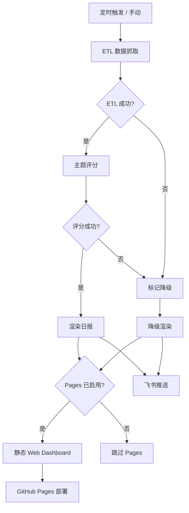

# 系统架构

## 流水线全景

Market Intel 包含三条独立流水线，分别负责不同市场的数据处理与报告生成。

### 全球市场日报（Daily Messenger）

四阶段流水线：



GitHub Pages 是可选分支。私有仓库当前通过 `ENABLE_GITHUB_PAGES=0` 并移除 Pages/OIDC 写权限，来暂停看板渲染、artifact 上传和部署。日报渲染与飞书投递继续运行。

| 阶段 | 入口 | 输入 | 输出 |
|------|------|------|------|
| ETL 抓取 | `daily_messenger/etl/run_fetch.py` | API 凭证、RSS/Atom | `raw_market.json`、`raw_events.json`、`etl_status.json` |
| 主题评分 | `daily_messenger/scoring/run_scores.py` | `raw_market.json`、历史状态 | `scores.json`、`actions.json` |
| 日报渲染 | `daily_messenger/digest/make_daily.py` | `scores.json`、`actions.json` | `index.html`、`digest_summary.txt`、`digest_card.json` |
| 静态看板 | `daily_messenger/dashboard/web_dashboard.py` | `out/*.json`、`data-snapshots/latest/`、可选状态面板 CSV | `web_dashboard.html`、`web_dashboard_payload.json` |
| 飞书推送 | `daily_messenger/tools/post_feishu.py` | `digest_card.json` | 飞书互动卡片 |

详见 [scoring.md](scoring.md) 了解评分算法，[contracts.md](contracts.md) 了解产物格式。

### A 股盘后分析

从 market-data-platform 读取 TuShare 日频数据，先形成可审计的市场事实，再生成确定性的市场温度解释层。解释层包含以下内容：

- 热度与脆弱度分开展示，不混为一谈。
- 六维固定为流动性、广度、赚钱效应、亏钱风险、趋势确认和轮动质量。
- 输出核心矛盾以及下一交易日的验证条件。
- 原始指数、市场总览、涨跌停、资金、两融、行业和个股表放在解释层之后，继续保留。

观察刻度未做回测，不映射仓位。

### 跨市场快照

`cross-market.yml` 曾在工作日 05:00 中国标准时间（CST）于 GitHub Actions 上运行，现已停用（重命名为 `cross-market.yml.disabled`）。跨市场快照改由本机 `local-fetch-cross-market.timer`（Layer 2）刷新，原 GitHub Actions 抓取的快照仅作为兜底（Layer 1）。抓取内容不变：使用 yfinance 抓取美股、日韩半导体核心标的、商品（GC=F、SLV、GLD）和 DXY，并拉取 AAII 情绪。VIX 与 10Y 使用 FRED：配置 `FRED_API_KEY` 或 `api_keys.json.fred` 时优先用 observations API，否则或在鉴权失败时，改用无需 key 的公开 CSV。VIX 写入历史字段 `cboe_putcall`，不再使用已停更的 CBOE CSV。结果持久化到 `data-snapshots/` 并 commit 回仓库。跨市场概念映射由 `a_share_daily.global_leadlag` 统一维护，按领先资产权重聚合到 A 股概念。

### TuShare 轻量快照

`tushare-daily.yml` 曾在工作日 09:30 CST 于 GitHub Actions 上运行，现已停用（重命名为 `tushare-daily.yml.disabled`）。TuShare 轻量快照改由本机 `asia-market-refresh.timer` 与增强数据 timer 刷新，结果持久化到 `data-snapshots/tushare/` 并 commit 回仓库，供备份任务和下游工具直接读取。

## 数据源矩阵

### 全球市场日报

| 数据域 | 主数据源 | 备用方案 |
|--------|----------|----------|
| 指数与主题行情 | Alpha Vantage、FMP stable quote、Twelve Data 兜底 | 单个源失败时记录降级，不阻断看板 |
| 港股行情 | HSI 行情源、FMP/Twelve Data 兜底 | Stooq 不稳定时标记 `hongkong_HSI=missing`，后续可改用代理 ETF（2800/2828.HK） |
| BTC 主题 | Coinbase、OKX、SoSoValue | 历史缓存。模拟回退必须在看板标为 `simulated` |
| 情绪指标 | Cboe Put/Call、AAII Sentiment | 上一期缓存 |
| 宏观事件 | Trading Economics、RSS、arXiv | Trading Economics 无有效凭证或 Calendar 权限时生成本地回退事件，并标为 `simulated` |
| AI 市场资讯 | 智谱 GLM-4.6（默认）/ 阿里百炼 Qwen 兜底 / Google Gemini 可选 | 多 Key 轮换，缺失时跳过 |

最近一次本机验证中，Alpha Vantage、FMP stable quote + EDGAR、Cboe、AAII、Coinbase、OKX、SoSoValue、GLM 和阿里百炼均可用。仍需处理的是 HSI 行情源和 Trading Economics Calendar 凭证/套餐。网页看板会在 `sourceAnalysis` 中逐项展示 `available`、`proxy`、`simulated`、`missing` 状态。

### 跨市场快照（可零认证）

| 数据域 | 数据源 | 标的 |
|--------|--------|------|
| 全球领先资产 | yfinance | 美股 Mag7（美股七巨头合称）/半导体、日韩半导体核心标的、SPY、QQQ、SMH |
| 商品 | yfinance | GC=F、SLV、GLD |
| 宏观指标 | yfinance + FRED | DX-Y.NYB（美元指数）。VIXCLS 与 DGS10 可用公共 CSV，配置 FRED key 时优先 observations API |
| 情绪 | AAII、Cboe/FRED VIX、Cboe VVIX | 散户多空调查、恐慌指数和波动率结构 |

### A 股

| 数据域 | 数据源 | 说明 |
|--------|--------|------|
| 全市场行情 | TuShare | 日频，包含涨跌幅、成交额、换手率等 |
| 资金流向 | TuShare | 北向资金、主力资金 |
| 融资融券 | TuShare | 两融余额 |
| ST 列表 | TuShare | 日频增量 |
| 指数权重 | TuShare | 沪深 300、中证 500 等 |
| 轻量快照 | TuShare（GitHub Actions） | 指数日线、涨跌家数、资金流向摘要、涨跌停列表 |

## 仓库结构

```text
market-intel/
  src/
    daily_messenger/       # 日报系统
      cli.py              # dm 命令入口
      common/             # 日志、运行元数据
      digest/             # 模板与日报渲染
      etl/                # 数据抓取器与降级模拟
      scoring/            # 主题评分、权重与阈值
      crypto/             # BTC K 线抓取与 TA 报告
      dashboard/          # 静态网页看板聚合层
      ta/                 # 技术分析指标计算
      tools/              # 飞书推送
    tushare_jobs/          # A 股 TuShare 数据任务
      cli.py              # marketops 命令入口
      lightweight_snapshot.py  # 轻量日频快照（GitHub Actions / 备份任务用）
      listed_company.py   # 上市公司基础数据
      stock_st.py         # ST 列表
      index_weight.py     # 指数权重
      index_weight_daily.py # 日频展开 + 漂移权重
    a_share_daily/         # A 股盘前/盘后流水线与图表
      cli.py              # a-share-daily 命令入口
      cross_market.py     # 跨市场 US→A 概念映射
      charts/             # 情绪、资金流、主题、跨市场等图表
    a_share_analysis/      # A 股分析工具箱
      value_regime_weekly.py # 价值因子周报，长期研究文档归档在 research-workspace/docs/
      style_analysis.py      # 5 因子回测
    style_replica_bridge/  # 风格复制桥接：把回测结果转成报告用 tearsheet
    ops_common/            # 共享运维工具
      env.py              # .env 加载与环境变量
      notify_email.py     # 邮件通知
  config/                  # 权重、TA 配置
  tests/                   # 测试
  .github/workflows/       # 原跨市场与 TuShare 快照的 GitHub Actions 兜底层，已重命名为 .disabled 停用，改由本机 timer 接管
  docs/                    # 文档
  data-snapshots/          # 跨市场 + TuShare 快照持久化
```

## 三个CLI

日报系统：`dm run` / `dm fetch` / `dm score` / `dm digest` / `dm dashboard` / `dm btc`

A 股数据：`marketops tushare daily-refresh` / `stock-st` / `index-weight` / `listed-company`

A 股分析：`a-share-daily morning` / `evening` / `review`

三条 CLI 独立调度：全球日报 18:00、TuShare 轻量快照 09:30、本地 Asia refresh 15:30、跨市场快照 05:00。跨市场快照和 TuShare 轻量快照均持久化到仓库，本地工具和备份任务直接读取。

## 模块职责补充

下面补上正文里提到、但分散在调度与配置文档、缺少集中说明的几个模块。

### DailyWatch20 准入门禁（`a_share_daily/daily_watch20_validation/`）

这是 DailyWatch20 产物发布前的严格准入校验，从 `daily_watch20.py` 物理拆出的子包，不对外暴露 API。它分三类契约：

- `candidate_contract.py`：候选池契约，校验候选股名单的边界、数量与字段完整性。
- `frame_contract.py`：帧、产物、伴随文件与分钟数据契约，校验产物内部结构、清单与分钟数据是否自洽。
- `receipt_contract.py`：回执契约，校验发布回执的字段、总量与帧是否对得上。
- `_common.py`：三者共用的常量与基础校验 helper。

任一契约未通过时，DailyWatch20 产物不渲染、不投递（严格失败即止），由当日回执 watchdog 告警。

### 市场温度计六维模型（`a_share_daily/market_temperature*.py`）

- `market_temperature.py`：纯计算、不做 I/O，消费 `review.py` 已产出的聚合值，输出观察性的热度评分（收益、参与度、相对自身历史等维度）。`heat_score` 只描述市场状态，不给仓位建议。
- `market_temperature_signals.py`：在归一化度量之上检测矛盾信号，把数值转成可读的张力与次日可复核的明确条件。
- `market_temperature_render.py`：把上述评分与信号渲染进报告版面。

### 看板状态面板（`dm state-panel` / `market_state_panel.csv`）

`daily_messenger/dashboard/state_panel.py` 生成可选的市场状态面板，是网页看板的数据源之一。它由 `dm dashboard` 流水线调用，输出 `market_state_panel.csv`，字段来自各报告模块的聚合状态（非独立抓取）。

### 环境加载与路径收口（`ops_common/env.py`）

`ops_common/env.py` 负责 `.env` 加载与环境变量解析，统一各模块读取配置的方式。当操作员显式设置 `MDP_FALLBACK_ROOT` 时，该路径会作为候选根目录追加进搜索顺序，用于数据根不可达时的兜底（详见 [boundary-contract.md](boundary-contract.md) 的跨仓边界约定）。
